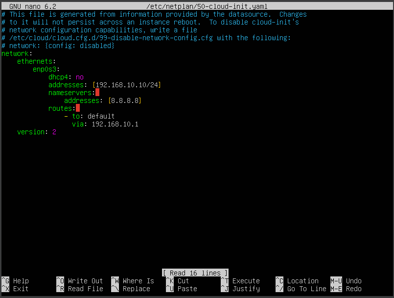

# Active Directory Server Attack Simulation and Monitoring
## Introduction

In this project, I sought to emulate a real world network where user accounts are created and place into organizational units through an Active Directory server. One of these accounts and the PC they was subject to an attack to an attack by a separate system, and the logs of the targeted pc and the Active Directory server are all ingested into a Splunk server within this network. The goal of this project was to not only create and learn about how networks in which permissions are given through Active Directory are structured, but to also learn how attacks are observed and detected within Splunk. Here is a diagram of the network below:


All of the devices within this metwork network were constructed as virtual machines where Virtualbox is the hypervisor used. 

## Specifications

Here are the specifications for each virtual machine. If the block is empty, then no specification or app was needed for that category:

||Splunk Server (AD-splunk)|Active Directory Server (AD-server)|Target PC (ADdemo)|Attacking PC (Pre-built Kali-linux VM)|
|-|-------------------------|-----------------------------------|------------------|--------------------------------------|
|OS|[Ubuntu 20.04 LTS](https://ubuntu.com/download/server)|[Windows Server 2022](https://www.microsoft.com/en-us/evalcenter/evaluate-windows-server-2022)|[Windows 10](https://www.microsoft.com/en-us/software-download/windows10)|[Prebuilt Kali Virtual Machine](https://www.kali.org/get-kali/#kali-virtual-machines)|
|Memory|8 gbs|4 gbs|6 gbs|2gbs|
|Storage|Storage: 100 gbs|50 gbs|50 gbs|80.09 gbs|
|Splunk|Splunk: [Splunk Enterprise](https://www.splunk.com/en_us/download/splunk-enterprise.html)|[Splunk Universal Forwarder](https://www.splunk.com/en_us/download/universal-forwarder.html)|[Splunk Universal Forwarder](https://www.splunk.com/en_us/download/universal-forwarder.html)||
|Sysmon||[Sysmon monitoring system](https://learn.microsoft.com/en-us/sysinternals/downloads/sysmon)|[Sysmon monitoring system](https://learn.microsoft.com/en-us/sysinternals/downloads/sysmon)||
|Sysmon Config|| [olafhartong Sysmon Configuration](https://github.com/olafhartong/sysmon-modular/blob/master/sysmonconfig.xml)| [olafhartong Sysmon Configuration](https://github.com/olafhartong/sysmon-modular/blob/master/sysmonconfig.xml)||


____________________________________________________________________________________________________________________________________________________________________________________________________________________
## 1. Network Configuration
It was important for this project to ensure that each virtual machine is on the same network and have internet access. In the virtualbox menu I navigated from Tools > Network > NAT Network > select create. From here I gave the new network the name AD-network, gave the IPV4 Prefix a value of 192.168.10.0/24, and finally selected apply.


Now for each virtual machine I selected Settings > Network. I then set "Attached to: " to NAT Network and then set "Name" to AD-network that you have chosen. Finally, I clicked "OK."


## 2. Splunk Server (AD-splunk) Configurations and Splunk Installation

In order to collect logs of and monitor our simulated attack, I needed to configure an instance of a an SIEM (Secure information Event Manager) within a system that ingests logs from other devices within this network. Here, I configured an Ubuntu based Splunk server. After my initial installation of my Ubuntu server virtual machine, I needed to give the server the static IP address that I specified in the diagram above (192.168.10.10). In order to do that, I entered this command into the Ubuntu terminal:

```
sudo nano /etc/netplan/50-cloud-init.yaml
```
Now that the file "50-cloud-init.yaml" was opened, I filled its contents with the following:



In order for the changes to this file to persist after a reboot, I entered this command:

```
sudo nano /etc/cloud/cloud.cfg.d/99-disable-network-config.cfg
```

Now that "99-disable-network-config.cfg" is open, I filled its contents with the following:


In order to apply these changes, I entered this command:

```
sudo netplan apply
```

Note: if you want to check and see if the static IP has been correctly applied, enter this command:
```
ip a
```

The Next step wa to install the guest addons for virtual box. In order to do so, I performed this command:
```
sudo apt-get install virtualbox-guest-additions-iso
```
I then typed "y" when prompted and hit "enter" and "enter" again once the the purple screen and menu appears. Now at the top of the server window (virtualbox menu at the top), I navigated from Devices > Shared Folders > Shared Folder Settings. I then selected the add folder button on the right side of the window. Under "Folder Path" I searched for and chose the path underwhich I stored stored the Splunk Enterprise download. Next I for "Folder Name" I entered "Splunk", and checked all of the boxes underneath.


I then clicked "OK" twice and returned to the server. Afterward I rebooted the server by typing:

```
sudo reboot
```

I then decided to add some virtual box installations that may have yet to be installed. Enter this command:

```
sudo apt-get install virtualbox-guest-utils
```

 I then rebooted one more time and after I logged in I added the my user to the "vboxsf" group by entering this command:

```
sudo adduser meadbag vboxsf
```

Where meadbag is my user. Now to mount the shared folder to a directory to a folder in the server, I created a folder named "share". I then entered this command:
```
sudo mount -t vboxsf -o uid=1000,gid=1000 Splunk share/
```
I then changed directions into the share folder. You can see it in the share folder here:


As you can see the Splunk installer file is visible in the image above. To perform my splunk install I entered this command:

```
sudo dpkg -i [splunk installer file]
```

Once I saw "complete" following this command, I changed to the /opt/splunk directory, which is where Splunk is now located. To enter the Splunk user and install Splunk, I entered these commands:
```
sudo -u splunk bash
cd bin
./splunk start
```

I went to the end of the user agreement and then entered "y" when I was prompted. I then entered and administrator username and password for my splunk instance. Afterward, I entered this command to ensure that every time I boot this server/virtual machine my splunk instance starts up:

```
exit
cd bin
sudo ./splunk enable boot-start -user splunk
```

## 3. Target PC (AD-demo) and Active Directory Server (AD-server) Configurations: Static IP addresses, Splunk Universal Forwarder, and Sysmon

Before installing these components, I made sure to the change the name of AD-demo to "target-PC" and AD-server to "ADserver" from the windows menu, this way these are the names of the hosts that appear in the Splunk logs. This can be done by navigating Windows menu > Type PC and select properties (in the windows server you may have to right click PC to get this option) > select "Rename PC". I then entered the new name and restarted these machines once prompted.

Now, in order to give these devices their static IP addresses I navigated to the network icon and right clicked it > Open Network & Internet Settings > Change Adapter Options > Right Click the Adapter and selected properties > doublie click Internet Protocol Version 4 (TCP/IPv4) > Selected "Use the following IP address" and "Use the following DNS server address". I then entred these values:</p>


### Target-PC


### AD-server


Next I installed Splunk Universal Forwarder. The link I showed above is the link to the Splunk Universal Forwarder installer, and I downloaded the installer from a web browser within my Target-PC and AD-server. Once the download was completed, I ran the installer, checked off the box that stated "Check this box to accept the License Agreement", selected "An on-premises Splunk Enterprise instance", and then selected "Next".


On the next page, I entered "admin" as the user name then selected "Next" twice, skipping over the Deployment Server as I did not have one. Under the Receiving Indexer, I entered the Splunk Server IP address under "Hostname of IP", which is 192.168.10.10, and for the default port I entered 9997.


Following this, I navigated Next > Install. With this install continuing in the background, I then went on to download Sysmon and retrieve olafhartong's Sysmon configuration, links for the webpages for both above. From olafhartong's page I selected "Raw", and, once the new page loaded, I right clicked > clicked "Save as" > saved into Downloads.


From this point I extracted the orginal downloaded Sysmon zip file > copied the file path > ran Powershell as Administrator and entered this command
```
cd [File path of Sysmon]
.\Sysmon64.exe -i ..\sysmonconfig.xml
```

This is how mine looked:


After running this command a pop-up titled "System Monitor License Agreement" with info titled "SYSINTERNALS SOFTWARE LICENSE TERMS" appeared. Once I clicked agree, Sysmon will now download onto your system and begin.


Once I saw the message "Sysmon64 started", I know the download was complete. By this point the Splunk Universal Forwarder also finished its installation, and with that, I opened the file explorer and navigated down this path: This PC > Local Disk (C:) > Program Files > SplunkUniversalForwarder > etc > system > local. From here I ran Notepad as administrator and created the file "inputs.conf" that contains this:


This is vital for instructing the Splunk forwarder on what to send to the Splunk server. This specifially instructs the forwarder to forward information related to application, security, system, and sysmon to the Splunk server. Also, the index named "endpoint" specified in this file will need a corresponding index named endpoint created in order to receive these events. I create that later when I access Splunk enterprise. </p>

Due to the fact that I created this "inputs.conf" file, I then followed that up by restarting the Splunk Forwarder Service. This action is necessary whenever inputs.conf is updated or changed. In order to do so, from the windows search bar at the bottom left I searched for the Services application > right clicked and chose Run as Administrator > Found "SplunkForwarder" among the list of applications and double clicked it > navigated to Log On > selected "Local System account" > click Apply and OK > Right click SplunkForwarder in services > select Restart.


I then received a pop-up message stating "Windows could not stop the SplunkForwarder service on Local Computer". However, I clicked OK > selected SplunkForwarder > clicked Start at the top left of the "Services (Local)" tab, and this forwarder was still functional.


## 4. Active Directory Server (AD-server) Configurations: Active Directory and Creating Users and Groups

In order to install and configure Active Directory into my AD server, I opened the Service Manager and navigated Manage > Add Roles and Features > Next > Ensured that "Role-Based or feature-based installation" is selected and click Next > Selected AD-server from a list of servers and clicked Next > Active Directory Domain Services > Add Features > Kept on clicking Next until I saw "Install" > Install. Once I saw "Configuration required. Installation Succeeded" under the progress bar, I knew that Active Directory has completed installation.

||||
|------------------------|-------------------------|-------------------------|


After closing out from the installation page, I returned to Server Manager and navigated from the Flag icon at the top of the window > Promote this server to a domain controller > Selected "Add a new forest", entered meadbag.local (needed a top level domain) as my Root domain name, and clicked Next > Entered a password and clicked Next > continued to click Next until I saw "Verifying prerequisites for domain > controller operation ..." > Install when it was available. Once the install was finished the server restarted on its own.

||||
|----------------------|----------------------|----------------------|

Once the reboot was finished, I saw that my login screen had MEADBAG\Administrator as the account to log into for the server. Now that I have installed Active Directory on this server, it is time for me to create a new organizational unit and a user that is assigned to that unit. In order to do this, I went back to main page of the Server Manager and navigated from Tools > Active Directory Users and Computers. From here I saw the top level domain(meadbag.local) of the active directory server and a list of all the organizational units within that domain on the left side, and on the right a list of premade groups.


I then right clicked meadbag.local and navigated from New > Organizational Unit. I then created two new units: IT and HR. Within the HR unit, I right clicked and navigated from New > User and gave this new user the name Terry Smith and the User logon name tsmith, and clicked Next. I then gave it the password Blamo@abc.69, unchecked "User must change password at next logon", and hit Next and Finish on the following page.


I then repeated the same steps to create a user named Jenny Smith with a user logon name of jsmith, the same password, and in the IT organizational unit.

## 5. Target PC (AD-demo) Configuration: Enabling Remote Desktop and Installing AtomicRedTeam

I signed into the jsmith (Jenny Smith) account through the Target PC. In order to enable remote desktop I had to search for PC in the search bar at the bottom left and navigated Properties > Advanced system settings > entered the administrator credentials (the credentials for the AD Server) and clicked Yes > the Remote tab > Select "Allow remote connections to this computer" > Select Users > Add > search for jsmith's account name > OK > OK > Apply > OK


Now, my next step was to install Atomic Red Team. My first step was to run Powershell as administrator, login using the administrator credentials again and enter this command:
```
Set-ExecutionPolicy BypassCurrentUser
```

Once I saw the image below, I typed "y" and hit enter:


My next step was to set an exclusion for the C drive to stop Microsoft defender from removing files from Atomic Red Team when I download them. In order to do so I navigated to the Upward facing arrow in the task bar's right hand side > Windows Security > Virus and Threat Protection > Manage Settings > Add or remove exclusions > Add an exclusion > Folder > This PC > Local Disk (C:) > Select Folder. Here is the C drive as part of the list of exclusions:


I then returned to the Powershell window and entered these commands:
```
IEX (IWR 'https://raw.githubusercontent.com/redcanaryco/invoke-atomicredteam/master/install-atomicredteam.ps1' -UseBasicParsing);
Install-AtomicRedTeam
```
Once prompted, I typed "y" and hit enter to install dependencies for Atomic Red Team. Once you see below, you know that the Atomic Red Team download and installation has been completed.


In order to see the full list of Atomics and their technique IDs, I opened the file explorer and navigated This PC > Local Disk (C:) > AtomicRedTeam > atomics.


## 6. Splunk Enterprise Configuration: Creating Endpoint Index

This can be done from either the AD server or the Target PC as this was done in a browser. I completed this from the Target PC, but that has no bearing on whether this can be done. I opened a browser and entered 192.168.10.10:8000 into the search bar. This brought me to the Splunk Web Portal, where I enter the same credentials that I entered when installing Splunk onto the Splunk server. 


After logging in, I navigated Settings at the top of the screen > Indexes > New Index > set the Index Name to "endpoint" as show in inputs.conf > save. The endpoint index is now be visible among the list of indexes. From this page I scrolled down and saw it among the other index.


Now, to enable my Splunk server to receive the data that is sent to endpoint from my machine, I navigated from Settings > Forwarding and receiving > Configure receiving > New Receiving Port > and I entered 9997 into "Listen on this port" (this is the same port that I set as the default port in the Splunk Forwarder) > Save. This brought me to a page titled "Receiving Data" with the port I entered listed.

|||
|-----------------------------|------------------------------------|

In order to see logs from devices, I navigated Apps > Search & Reporting > In the search bar I entered "index=endpoint". This search produces logs from all the devices (the Target PC and the AD Server) forwarding them to the Splunk server I created earlier, and these logs contain information on Application, System, Security, and Sysmon (as defined in inputs.conf).

||||
|------------------------------|------------------------------|------------------------------|


## 7. Attacking PC Configuration: Static IP

I logged into the prebuilt Kali VM specified above (default credentials were username: kali and password: kali). I then right clicked the ethernet icon in the top right and navigated Edit Connections > Selected Wired connection 1 and then clicked the gear icon at the bottom of the window > IPv4 Settings. From here I set Method to Manual. Following this I clicked Add to add a new addresss, which I gave the following values:

Address: 192.168.10.250</p>
Netmask: 24</p>
Gateway: 192.168.10.1</p>

I then gave the DNS server a value of 8.8.8.8 and clicked Save.


Now in order to have these changes active, I clicked the ethernet icon at the top of the screen, selected Disconnect, clicked the ethernet icon again and clicked Wired connection 1. </p>

Before working with this, I opened the terminal and made sure to run this command to ensure everything is up to date:
```
sudo apt-get update && sudo apt-get upgrade -y
```

____________________________________________________________________________________________________________________________________________________________________________________________________________________
## Attack Simulation and Monitoring

### Brute Force Simulation

The goal of this attack simulation is to perform a brute force attack on the jsmith (Jenny Smith) account using the Remote Desktop Protocol that I enabled earlier. In order to do this I logged into my kali linux machine, opened the Terminal, and created a directory called "ad-project" and change to that directory. For this brute force attack, I will be using the hydra command in linux (this can alsi be done with installing crowbar instead). Before I got to that though I needed a list of potential passwords for this attack. In my kali linux machine I had the file  ```/usr/share/wordlists/rockyou.txt.gz``` . This is a popular wordlist file that is typically in kali linux machines.I used this to create my list of passwords by running these commands:

```
sudo gunzip /usr/share/wordlists/rockyou.txt.gz
cp /usr/share/wordlists/rockyou.txt.gz ad-project
```

In order to save time and memory, as the rockyou.txt is a large file, I ran this command to create a file that only has 20 lines:

```
head -n 20 rockyou.txt > passwords.txt
```

The next step I took, was to add the password for the jsmith account, Blamo@abc.69, to the end of passwords.txt by typing ```nano passwords.txt```, entering the password at the bottom and saving.


After saving an exiting that file, I then ran this command to perform the attack:

```
hydra -l jsmith -P passwords.txt 192.168.10.100 rdp
```

Here was outcome of running this command:


This is what a successful attempt at a brute force attack on the jsmith account looks like. I then went to Splunk to see if the logs of this attack had been ingeested. Into the search bar I entered "index=endpoint jsmith" and set the search for the past 15 minutes, during which my simulated attack occurred. After performing this search and selecting EventCode on the left- hand side, I saw 29 instances of the [event code 4625](https://www.ultimatewindowssecurity.com/securitylog/encyclopedia/event.aspx?eventid=4625) which is the Windows event ID for a failed login attempt.


After entering the search "index=endpoint jsmith EventCode=4625", I saw that most of these failed login attempts occurred less than one minute away from each other, implying a brute force attack attempt, and each log has details of the account being attacked, the attackign workstation's name and IP address, and the details of the login error detected.


### Atomic Red Team - Persistence Tactic for an Attack: Create New User in Domain

In order to perform a persistence attack, during which we create a new account to target the Target-PC, as defined by the [Mitre Att&ck framework]((https://attack.mitre.org/)), I logged into my Target PC using the jsmith account, opened the file explorer and navigated This PC > Local Disk (C:) > AtomicRedTeam > atomics > and searched for the folder labeled T1136.001. This file corresponds to the to the MITRE attack type [T1136.001: Create a Local Account](https://attack.mitre.org/techniques/T1136/001/).


Now that I have found this folder, I ran powershell as administrator to begin this attack. I then entered this command:

```
Invoke-Atomic T1136.001
```

Once I saw what is shown below I knew that the command and account create had been successfully ran:


As seen in the image above there was a new account name "NewLocalUser" that has been created and deleted. I then opened Splunk Enterprise and conducted the search "index=endpoint NewLocalUser" to see if this was reflected in the logs. There are 24 events. Because we know that the account had been created and deleted, this means that within these logs there should be a a log with [Event Code 4720](https://www.ultimatewindowssecurity.com/securitylog/encyclopedia/event.aspx?eventid=4720), which is the Windows log event ID for an account creation, and a log with [Event Code 4726](https://www.ultimatewindowssecurity.com/securitylog/encyclopedia/event.aspx?eventid=4726), which is the Windows log event ID for an account deletion.


#### Account Creation


#### Account Deletion


As seen above, the logs of the creation and deletion of this account have been ingested into my Splunk instance and are observable.
